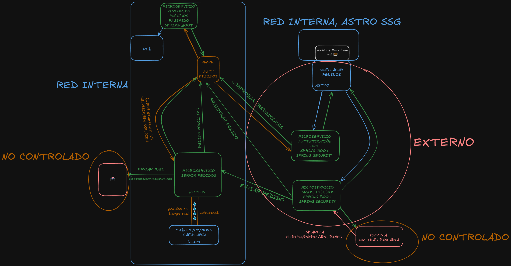

# 📌 Sistema de Gestión de Pedidos para Cafetería

## 📖 Descripción

Este proyecto es un sistema de gestión de pedidos para una cafetería, desarrollado como Trabajo de Fin de Grado para el ciclo de Desarrollo de Aplicaciones Web (DAW). Consiste en una aplicación basada en microservicios que permite realizar, gestionar y procesar pedidos en tiempo real.

El desarrollo sigue una metodología **iterativa e incremental**, dividiéndose en **tres iteraciones**. El equipo está compuesto por:

- **Aitor Pascual Jiménez**
- **Agustín Márquez Piña**

## 🛠️ Tecnologías Utilizadas

| Componente                  | Tecnología |
|-----------------------------|------------|
| **tecnologías base** |HTML, CSS, JavaScript, TypeScript, Java, SQL |
| **Frontend Web**            | framework Astro |
| **Frontend Cafetería**      | framework React |
| **Backend - Gestionar Pedidos** | framework Spring Boot |
| **Backend - Autenticación**  | framework Spring Boot (Spring Security, JWT) |
| **Base de Datos**           | MySQL |
| **Pasarela de Pago**        | API Banco / sumUp API |
| **Backend - Servir Pedidos** | framework Nest.js |
| **Comunicación en tiempo real** | WebSockets (Socket.io)|
| **Despliegue** | Docker / Kubernetes |

---

## 🎨 Diseño incial

## 🔄 Iteraciones de Desarrollo

### 🏁 Iteración 1: Configuración y Autenticación
- Configuración inicial del repositorio y estructura de microservicios.
- Implementación del **microservicio de autenticación** (JWT con Spring Security).
- Creación de la **base de datos** en MySQL y estructura inicial.
- Implementación de **WebSockets** en Nest para actualizaciones en tiempo real en la cafetería.
- Creación del **frontend React** para la cafetería.

### 🚀 Iteración 2: Gestión de Pedidos en Tiempo Real
- Desarrollo del **microservicio de pedidos** con Spring.
- Integración del **microservicio de pedidos** con la base de datos y autenticación.
- Desarrollo de la **web para hacer pedidos** con Astro.
- Integración con pasarelas de pago.

### 🔥 Iteración 3: Histórico de Pedidos y Mejoras Finales
- Desarrollo del **microservicio de histórico de pedidos**.
- Implementación de envío de correos electrónicos con la confirmación de pedidos.
- Despliegue en Docker / Kubernetes
- Pruebas de carga y optimización del sistema.
- Documentación y entrega final.

---

## 📌 Instalación y Configuración